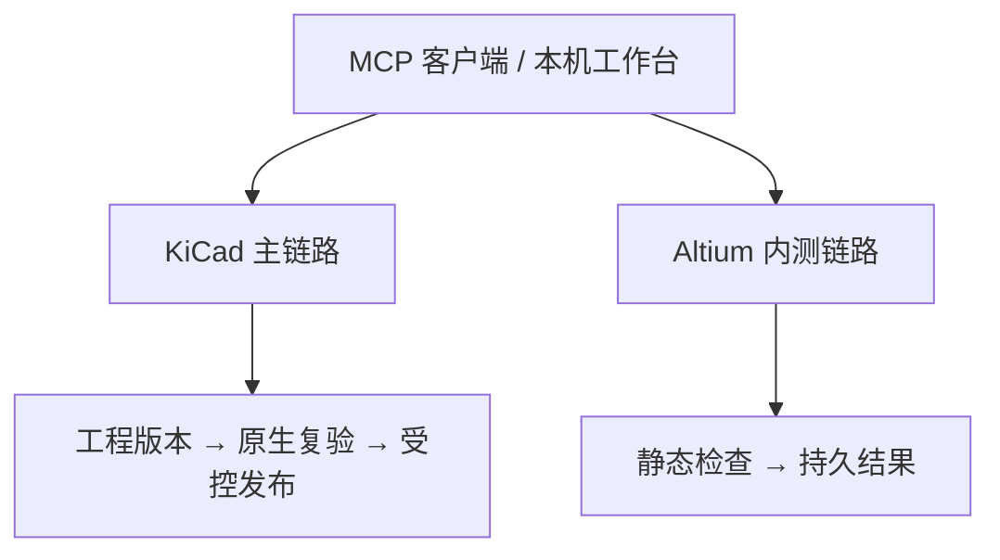

# PCB Weaver

面向 PCB 工程的本机 MCP 与工作台：以 KiCad 为主链路，另提供独立的 Altium 静态检查内测服务。

> [!IMPORTANT]
> 项目处于开发者内测阶段。**KiCad 的样例验收不等于任意 PCB 都能自动布通；Altium 服务目前不能自动布线或回写 PCB。** 软件检查也不能替代工程师审查、打样与制造签核。

## 能力概览

| 入口 | 已实现 | 尚未覆盖 |
| --- | --- | --- |
| **KiCad 主 MCP** | 工程导入、约束布局、布线编排、原生复验、ECO、受门禁保护的制造包 | 任意复杂板的全自动完成；硬件可靠性和量产签核 |
| **Altium 内测 MCP** | 允许目录内的静态工程检查、持久任务、断线续查 | 自动布线、PCB 回写、完整 DRC、制造放行 |

## 技术链路



两条链路的 MCP、任务队列和数据目录相互独立。模块关系、执行阶段和失败门禁见[技术架构](docs/ARCHITECTURE.zh-CN.md)。

## 快速开始

**KiCad 主链路**（Windows PowerShell）：

```powershell
./Setup.ps1
./Start-Platform.ps1
```

工作台默认在 `http://127.0.0.1:8765`；端口占用时运行 `./Start-Platform.ps1 -Port 8766`。`Setup.ps1` 安装项目 Python 依赖并生成本机 `.mcp.json`；原生路由仍需另行安装 KiCad、Java 和 Freerouting。可用 `./Run-Demo.ps1` 运行小板回归，`-Route` 才会尝试完整工具链。

**Altium 静态检查内测**（单独配置）：

```powershell
./Setup-Altium-Service.ps1 -ProjectRoot 'D:\PCB-Projects'
./Start-Altium-Service.ps1
```

把生成的 `altium-local-developer-beta` 条目添加到支持 stdio 的 MCP 客户端。先调用 `altium_service_status`，再提交 `altium_submit_inspection`；任务结果用 `altium_get_job` 查询。完整安装及限制见[内测配置](docs/GITHUB-RELEASE.zh-CN.md)。

## 文档导航

| 想了解 | 文档 |
| --- | --- |
| 模块、任务、版本和工程门禁 | [技术架构](docs/ARCHITECTURE.zh-CN.md) |
| Altium 工具与故障恢复 | [Altium 内测服务](docs/ALTIUM-SERVICE-BETA.zh-CN.md) |
| 本机机器接口与企业接入边界 | [集成说明](docs/INTEGRATION.zh-CN.md) |
| KiCad 实测范围与历史记录 | [固定布局验收](docs/FIXED-WHOLEBOARD-VALIDATION.md)、[系统验证](docs/SYSTEM_VALIDATION.zh-CN.md) |

公开仓库不包含本机工程、配置和大体积原生验收存档；克隆后必须在自己的工具链上重新验证。主项目使用 [Apache-2.0](LICENSE)，示例与第三方材料按[各自许可](THIRD_PARTY.md)使用。
