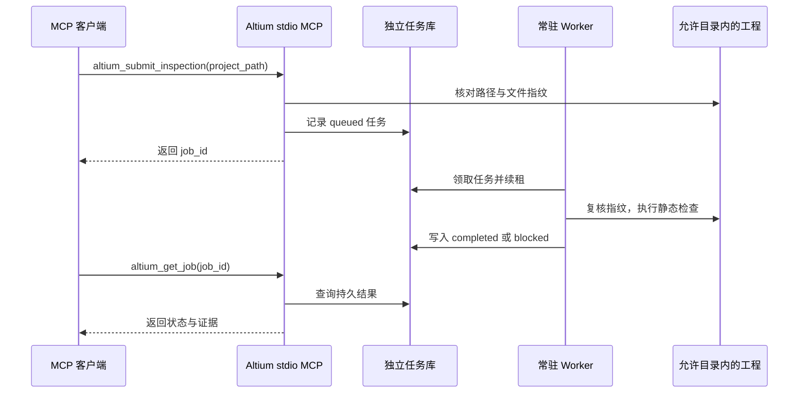

# Altium 本机开发者内测服务

> [!WARNING]
> 当前可供开发者内测的是**本机任务服务和静态工程检查**，不是 Altium 自动布线器。任务 `completed` 只说明该任务执行完毕，不代表 PCB 已布线或可制造。

[返回首页](../README.md) · [系统架构](ARCHITECTURE.zh-CN.md) · [新机器配置](GITHUB-RELEASE.zh-CN.md)

## 一次检查如何流转

MCP 会话断开不会清除任务；没有 worker 时任务停留在 `queued`。源文件在提交后变化会阻断处理，不会继续使用旧指纹。原生检查是**另一个受限分支**，不在上图的默认静态流程中。

## 能力边界

本版包含独立的本机任务服务、常驻工作进程和 stdio MCP。它复用现有的 Altium 工程检查逻辑，不修改原始工程，不提供自动布线、路由结果写回、全量 DRC 或制造放行。

| 类别 | MCP 工具 | 结果含义 |
| --- | --- | --- |
| 服务与任务 | `altium_service_status`、`altium_get_job`、`altium_list_jobs`、`altium_cancel_queued_job` | 查看配置和持久状态；只能取消排队任务 |
| 静态检查 | `altium_submit_inspection` | 检查允许目录内的工程文件，不调用 Altium |
| 受限原生检查 | `altium_submit_native_check`、`altium_get_native_report` | 默认门禁禁止启动；已完成时可读取对应证据 |

`altium_submit_inspection` 还会检查显式列出的 PCB、原理图等文档；`altium_submit_native_check` 仅覆盖现有实验实现支持的部分原生规则，默认会得到 `blocked`。`altium_service_status` 报告配置、任务数量和能力门禁。

## 本机启动

1. 新机器先按[GitHub 内测配置说明](GITHUB-RELEASE.zh-CN.md)运行 `./Setup-Altium-Service.ps1`，生成本机专用的 `altium-service.mcp.json`。当前电脑已有配置，不要覆盖。
2. 在项目根目录运行 `./Start-Altium-Service.ps1`，保持工作进程运行。仅处理一项后退出可用 `./Start-Altium-Service.ps1 -Once`。worker 会读取与 MCP 相同的 JSON 配置，不再假定其他电脑存在当前机器的 Altium 安装路径。
3. 将 `altium-local-developer-beta` 条目导入支持 stdio 的 MCP 客户端。旧 `altium-developer-beta` 入口仍保留作历史对照；新任务请使用本机服务入口。本版不修改全局客户端配置。移动目录或更换电脑时需重新生成本机配置。
4. 先调用 `altium_service_status`，确认允许的工程根目录和任务数据库路径，再提交静态检查。未启动工作进程时任务保持 `queued`，MCP 断线不会删除任务。

默认任务库位于 `data/altium-service/jobs.sqlite3`。原生检查证据仍位于 `docs/validation/altium-beta`；原始工程目录与证据目录分离。所有任务均记录输入文件指纹，执行前再次核对；输入变化会阻断，不会对旧快照继续执行。

## 故障与恢复

工作进程通过租约续期。进程中断后，过期的 `running` 任务转为 `blocked`，**不会自动重试原生操作**。先查看任务详情、Altium 窗口和 `docs/validation/altium-native/pending.json`，再决定是否重新提交。已排队任务可取消；运行中的原生进程不会被 MCP 强制结束。

`ALTIUM_SERVICE_NATIVE_LAUNCH=0` 是默认值，公开版 [`Start-Altium-Service.ps1`](../Start-Altium-Service.ps1) 也会拒绝非 `0` 配置。底层实验实现即使显式设为 `1`，仍要求 Windows、没有已打开的 `X2.EXE` 且没有待确认原生锁，且只尝试现有隔离副本检查；**这不是公开内测启动流程**。当前机器在现有 Altium 实例上的外部自动调度尚未通过验收；不要把该选项当成可靠的生产自动化开关。完整原生写入、路由回写、全板 DRC 与 MCP 自动调度仍须按本机 `docs/validation/altium-route-v1/阶段验收记录.md` 逐项证明；该存档不随公开仓库发布。

## 本机阶段验收

针对性测试共 35 项通过，覆盖重复请求、源文件变更、服务数据库路径隔离、默认原生门禁、租约超时、队列取消，以及真实 MCP 子进程握手、提交、独立 worker 执行和断线重连查询。测试夹具只验证服务与协议行为，不等于 Altium 原生布线验收。

另用本机配置对官方示例 `SpiritLevel-SL1` 完成一次真实 MCP 提交、断开客户端、独立 worker 执行和重连查询；10 个显式工程文件核对未变，原生 Altium 未启动。证据保存在本机 `docs/validation/altium-service-beta/acceptance.json`，不随公开仓库发布。后台常驻 worker 也独立领取并完成了随后提交的静态检查任务。原生自动调度、路由写回和制造检查仍未通过。
