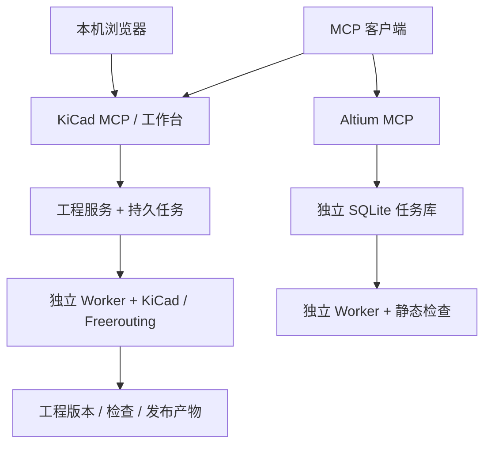
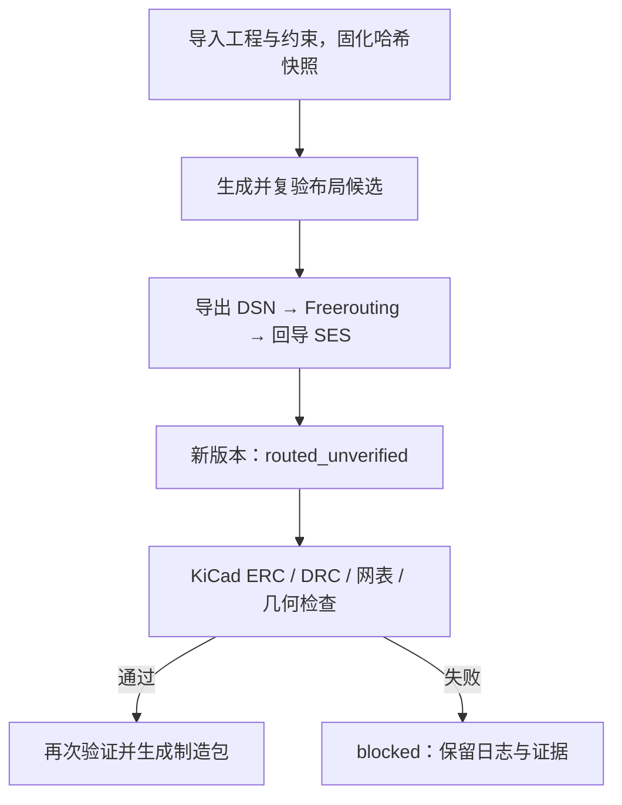

# 技术架构

[返回首页](../README.md) · [Altium 内测](ALTIUM-SERVICE-BETA.zh-CN.md) · [本机集成接口](INTEGRATION.zh-CN.md)

> [!NOTE]
> KiCad 与 Altium 是两条独立的本机链路。它们不共享任务库，也没有统一的自动布线引擎。

## 系统组成

| 层 | 主要实现 | 职责 |
| --- | --- | --- |
| KiCad 入口 | [`server.py`](../src/pcb_weaver/server.py)、[`platform.py`](../src/pcb_weaver/platform.py) | MCP stdio 与本机工作台 |
| 工程执行 | [`service.py`](../src/pcb_weaver/service.py)、[`jobs.py`](../src/pcb_weaver/jobs.py)、[`worker.py`](../src/pcb_weaver/worker.py) | 版本门禁、任务快照与后台执行 |
| 原生工具 | `toolchain.py`、`native_bridge.py` | KiCad CLI/pcbnew 与 Freerouting |
| Altium 内测 | [`altium_service_mcp.py`](../scripts/altium_service_mcp.py)、[`altium_service_worker.py`](../scripts/altium_service_worker.py) | 独立 MCP、队列与静态检查 |

可选的[本机机器接口](INTEGRATION.zh-CN.md)接入 KiCad 工程域，默认关闭；它不是已认证的企业平台连接器。

## KiCad 工程流水线

- **输入**：已有原理图、网络和封装的 KiCad 工程，以及结构化约束；不是一句自然语言需求。
- **版本**：导入、布局应用、布线回导会生成新 revision。原工程不被直接覆盖，受管理副本受哈希校验。
- **验证**：回导成功仍是 `routed_unverified`；只有对应版本的原生检查通过，才能尝试受门禁保护的发布。
- **变更**：ECO、局部补线和受限重布都会产生新证据；不能拿旧版报告给新版放行。

## 状态与边界

| 看到的状态 | 正确理解 |
| --- | --- |
| 任务 `completed` | 任务执行结束，不自动代表 PCB 可制造 |
| 任务 `blocked` | 输入、能力或检查未满足要求；保留原因与日志 |
| 版本 `routed_unverified` | 铜线已回导，但尚未通过独立原生复验 |

已通过的样例只证明其冻结输入、配置和工具链环境，见[固定布局验收](FIXED-WHOLEBOARD-VALIDATION.md)和[系统验证](SYSTEM_VALIDATION.zh-CN.md)。系统不提供任意复杂板的保证，也不替代 SI/PI、EMC、安规、机械、装配、CAM 和实板测试。

Altium 内测服务默认关闭原生启动，仅提供静态检查与持久任务；不能自动布线、回写原工程或借用 KiCad 的发布门禁。详见[Altium 服务说明](ALTIUM-SERVICE-BETA.zh-CN.md)。
