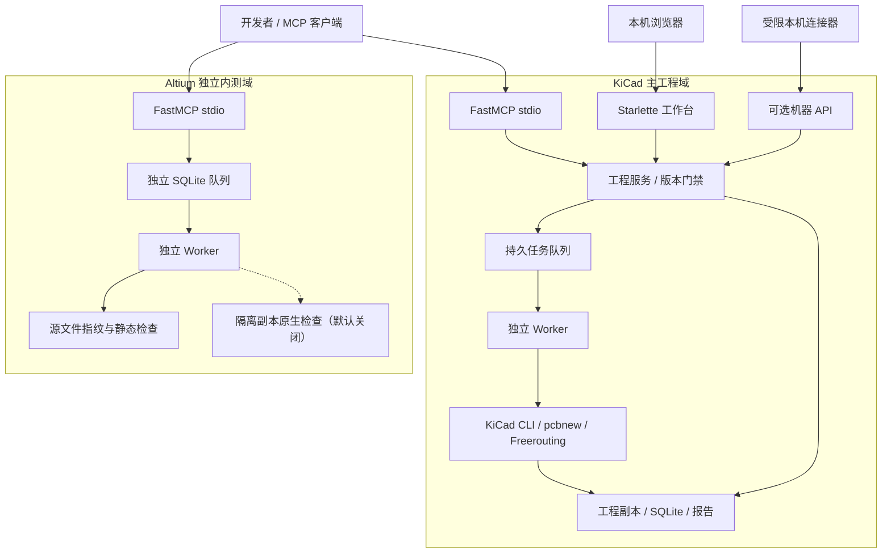
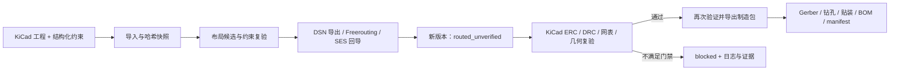

# PCB Weaver 技术架构

> [!NOTE]
> 这份文档描述当前源码的组件关系和工程门禁。KiCad 主链路与 Altium 开发者内测服务拥有不同入口、队列和数据目录；下图中的虚线表示可选能力，不表示两套系统已打通。

[返回首页](../README.md) · [Altium 服务](ALTIUM-SERVICE-BETA.zh-CN.md) · [本机集成接口](INTEGRATION.zh-CN.md)

## 组件拓扑

两套 MCP 均使用 stdio；工作进程独立于 MCP 会话。浏览器工作台和可选机器 API 属于 KiCad 主工程域，不能把它们当作 Altium 自动布线服务。

## 责任分离

| 层 | 实现 | 责任 |
| --- | --- | --- |
| 工程决策 | `skills/pcb-engineering/` | 澄清设计约束、选择可行候选、解释风险与交付结果 |
| 客户端协议 | [`server.py`](../src/pcb_weaver/server.py)、[`cli.py`](../src/pcb_weaver/cli.py) | KiCad MCP stdio 工具、资源、Prompt，以及 CLI |
| 工作台与任务 | [`platform.py`](../src/pcb_weaver/platform.py)、[`jobs.py`](../src/pcb_weaver/jobs.py)、[`worker.py`](../src/pcb_weaver/worker.py) | 本机 HTTP、持久化任务、独立工作进程 |
| 业务规则 | [`service.py`](../src/pcb_weaver/service.py) | 导入、版本、计划应用、路由、验证、ECO、制造发布 |
| 计算与解析 | `board.py`、`planning.py`、`eco.py`、`netlist.py` | S-expression 几何、数值优化、依赖解释、XML 网表一致性 |
| 规则转换 | `models.py`、`compiler.py` | 严格 Schema、制造下限编译、禁用关键检查的识别 |
| 原生 EDA | `toolchain.py`、`native_bridge.py` | KiCad CLI/pcbnew、Java Freerouting、真实报告与文件 |
| 存储与展示 | `storage.py`、`report.py` | SQLite、工程副本、哈希清单、HTML 审阅报告 |
| Altium 内测域 | [`altium_service_mcp.py`](../scripts/altium_service_mcp.py)、[`altium_service.py`](../scripts/altium_service.py)、[`altium_service_worker.py`](../scripts/altium_service_worker.py) | 独立 MCP、任务库与静态检查；原生检查受显式门禁约束 |

Skill 中的语言约束不是唯一防线。MCP 和 CLI 使用同一服务，直接调用发布工具仍要重新验证。

## 输入到输出

箭头表示阶段依赖，不代表每个输入都能自动走到发布。回导仅生成待验证版本；原生检查失败、未知几何或缺失必要证据时必须阻断。

1. 输入是已经具备原理图、网络和封装的 KiCad 项目，不是任意一句产品需求。导入会复制相关设计文件，检查层次子页和项目库的本地依赖，并编译声明的制造下限。
2. 每个工程版本保存 PCB、原理图、项目规则、本地原生库及约束的摘要。修改原始工程不影响已导入副本；修改受管理副本会被下一次操作识别并拒绝。
3. 优化器保持器件角度、固定器件，使用实际焊盘坐标估算 HPWL，并以板框、器件间距、区域、邻近条件复验候选。可行不代表全局最优，也不代表电气性能最优。
4. 应用已记录的候选生成子版本。路由在子版本工作副本上执行 DSN 导出、Freerouting、SES 回导。核对身份、位置、网络后才登记新版本；回导成功的状态仍是 `routed_unverified`。
5. 验证在独立的完整项目副本上执行 DRC、ERC、XML 网表一致性及声明约束。保留真实日志与报告。未知几何、缺失必要检查、未连接或关键错误会阻止发布。
6. 发布再次执行验证，从同版本生成 Gerber、钻孔、贴装位置和 BOM；有原理图时核对装配位号集合。所有设计、约束、检查和产物打包为带哈希 manifest 的 ZIP。
7. 外部修改重新导入为 ECO 子版本，输出直接变化、相邻网络影响、受影响约束和失效工件。当前还提供显式受限的局部拆线重布和自动修复入口，但任何采用的铜线结果仍须全板原生复验；不能只凭局部检查放行。

## 状态与失败

持久任务的 `queued`、`running`、`completed`、`blocked` 等状态描述**任务执行**；工程版本的 `routed_unverified`、已验证结果及发布记录描述**设计证据**。二者不能互换：`completed` 不是制造授权，`blocked` 也不能改写成“基本通过”。

- 导入、应用布局和成功回导分别产生新的 revision ID；不能用旧 ID 代表新板。
- `blocked` 表示缺失能力、超出支持范围或检查不满足，不是成功预演。
- 每项目文件锁防止协作客户端同时修改受管理状态。外部程序不受该锁管理，因此操作前后仍校验文件摘要。
- 未成功的路由和导出可能保留未登记的暂存目录与日志以便诊断，但不会自动成为已验证版本或正式发布包。
- 外部工具通过参数数组启动，设有超时；服务不执行来自器件属性、原理图文本或模型回答的任意 shell 命令。
- manifest 校验验证文件集合和字节完整性，不证明签发者身份；本地 SQLite 哈希链不是经过外部锚定的合规审计账本。

## 工程边界

当前源码覆盖布局、固定布局整板完成、局部补线与受限重布等多条 KiCad 路径；部分双层和四层样例已有原生通过记录，详见[固定布局验收](FIXED-WHOLEBOARD-VALIDATION.md)及[系统验证](SYSTEM_VALIDATION.zh-CN.md)。这些记录只证明对应冻结输入、配置与环境，不能推断任意复杂板或生产制造通过。规则编译使用保守的制造下限，不提供完整阻抗合成、差分时序调优或硬件可靠性签署。

项目表中引用的库必须在工程副本内；全局 KiCad 库、3D 模型及全部用户工具设置并未被完整封存。验证和发布会报告此依赖范围。该版本不是用于运行不可信原生 EDA 文件的沙箱，也不提供多租户远程鉴权服务。

KiCad 的原生兼容层会探测不同接口，但其他版本不能因探测成功就视为实机通过。Altium 内测服务的默认启动脚本强制 `ALTIUM_SERVICE_NATIVE_LAUNCH=0`；它不自动路由、不回写原工程，也不复用 KiCad 的制造门禁。详见[Altium 服务边界](ALTIUM-SERVICE-BETA.zh-CN.md)。

完成软件链路后仍需硬件工程师进行功能、电气裕量、SI/PI、热、EMC、安规、机械、装配旋转、物料与工厂 CAM 审查，以及真实打样测试。软件不能自动签署这些未覆盖的结论。
