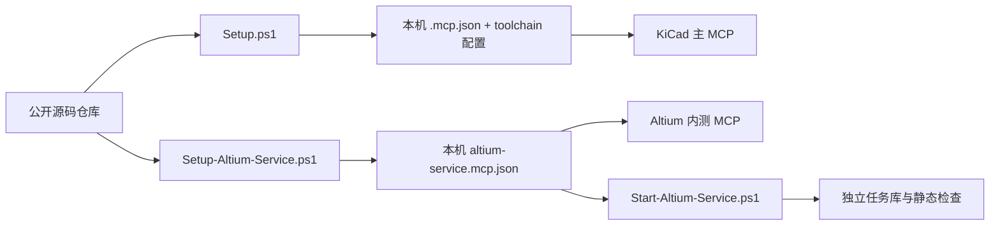

# GitHub 开发者内测版配置

> [!TIP]
> 先选择使用哪套 MCP：KiCad 主入口需要本机 EDA 工具链；Altium 内测入口需要允许检查的工程目录和独立 worker。两个入口不能共用配置，也不能互相替代。

[返回首页](../README.md) · [技术架构](ARCHITECTURE.zh-CN.md) · [Altium 任务说明](ALTIUM-SERVICE-BETA.zh-CN.md)



生成的本机配置、工程文件、任务库和历史验收资料不随源码仓库发布。下面的步骤只配置 **Altium 开发者内测服务**；KiCad 安装入口见[首页](../README.md#本机使用)。

## 能力边界

项目包含两个不同的本机 MCP：`pcb-weaver` 面向 KiCad 工程链路；`altium-local-developer-beta` 面向 Altium 工程静态检查及受限原生检查。本页只给出 Altium 开发者内测服务的新机器配置流程。Altium 服务目前不能自动排版布线、写回 PCB、全量 DRC 或制造放行。不要把历史 KiCad 验收结果描述成 Altium 自动布线能力。

## Windows 新机器安装

安装 Python 3.11 或更新版本，并克隆本项目。在项目根目录运行：

```powershell
./Setup-Altium-Service.ps1 -ProjectRoot 'D:\PCB-Projects' -AltiumExe 'C:\Program Files\Altium\AD26\X2.EXE'
```

`-ProjectRoot` 指向实际存放 `.PrjPcb` 的目录；可传多个目录。只做静态检查时可省略 `-AltiumExe`，但仍需真实的 Altium 工程文件。脚本建立本地 `.venv`，安装 MCP Python SDK，并生成 `altium-service.mcp.json`。已存在配置时脚本会停止，不会覆盖。该 JSON 含使用者本机绝对路径，不应提交到 GitHub。

若当前 PowerShell 禁止运行脚本，可用 `powershell -NoProfile -ExecutionPolicy Bypass -File .\Setup-Altium-Service.ps1 -ProjectRoot 'D:\PCB-Projects'` 在单个进程中启动；启动 worker 时对 `Start-Altium-Service.ps1` 使用相同方式。不要为此永久修改整机执行策略。

将生成的 `altium-local-developer-beta` 服务器条目导入支持 stdio 的 MCP 客户端。然后在另一个终端、同一项目根目录运行：

```powershell
./Start-Altium-Service.ps1
```

先调用 `altium_service_status`，确认允许的工程目录；调用 `altium_submit_inspection(project_path=...)` 后，使用返回的 `job_id` 调用 `altium_get_job`。worker 未运行时任务会保持 `queued`。`ALTIUM_SERVICE_NATIVE_LAUNCH` 固定为 `0`；内测安装脚本不开放自动原生启动。原生检查的实验条件和故障恢复见[服务说明](ALTIUM-SERVICE-BETA.zh-CN.md)。

KiCad 主 MCP 则按项目根目录的 `Setup.ps1`、`toolchain.*.json` 和 [README](../README.md) 独立配置；还需本机 KiCad、Java 与 Freerouting。两套入口不能互相替代。

## 发布前人工检查

- 本机 `.mcp.json`、`altium-*.mcp.json`、`data/`、`benchmark-data/`、`benchmarks/results/`、`tools/jre25-linux/`、`docs/validation/`、`REVIEW.html` 以及两个嵌套的 KiCad 上游源码检出目录已被 `.gitignore` 排除；这些目录保留在当前电脑上，不会因忽略规则被删除。历史文档中指向这些验收存档的链接在公开源码仓库中不会生效；相关测试在证据目录缺失时会明确跳过，不能把跳过算作原生验收通过。
- 检查 `scripts/` 中旧的 Altium 实验脚本及文档中的本机绝对路径，不要把它们当成可移植的正式入口；公开前还应排查私人工程、日志、密钥和厂商资料。
- 主项目已采用根目录 `LICENSE` 所载的 Apache-2.0，并在 `pyproject.toml` 标识。第三方组件及示例电路仍按各自通知使用，详见 `THIRD_PARTY.md`；不要把主项目许可套用到 KiCad 衍生示例上。
- 在一台没有本机缓存和历史验收文件的 Windows 机器上完成安装、MCP 握手、静态检查、worker 执行和重连查询。此项尚未完成前，不应宣称“克隆即用”或生产可用。
